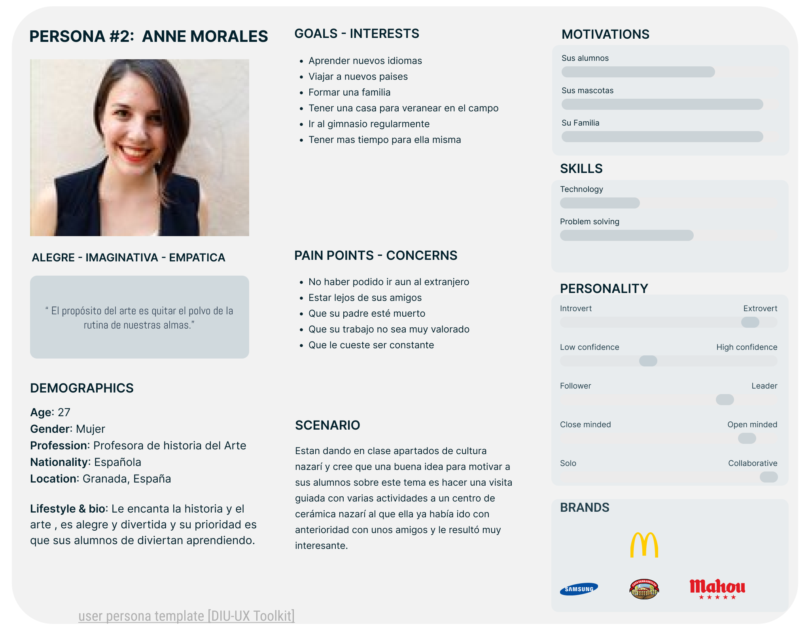
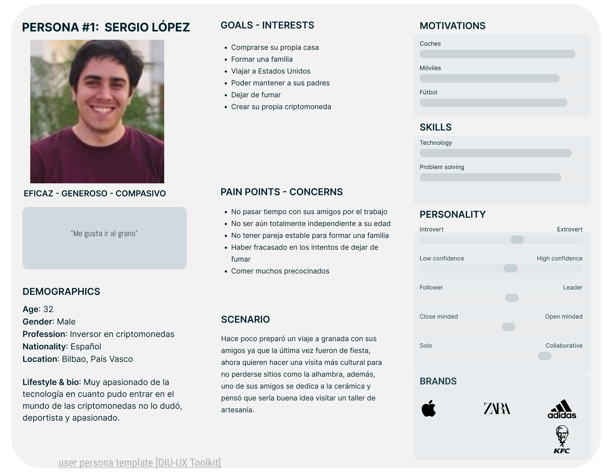
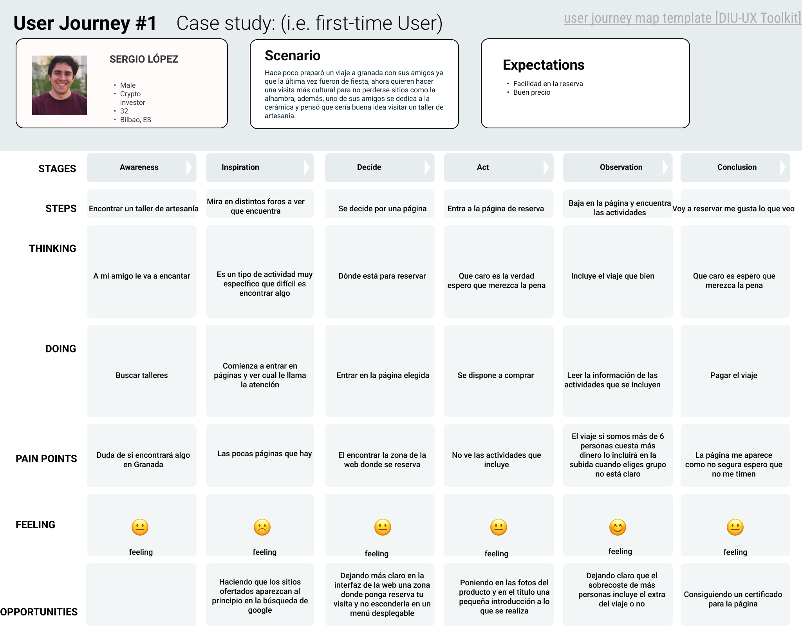

## DIU - Practica1, entregables 

 1.a Empathy Map

La página es muy caótica el sentimiento del usuario estará muy compuesto por situaciones de desorientación. El tema de la seguridad da mucha desconfianza.  

 1.b Competitive Analysis
-----

La competencia más directa que hemos encontrado se trata de [Kerarqueo](https://www.kerarqueo.com/), empresa la cual tiene de 2 a 10 empleados y que se encuentra en la calle Recogidas, respecto a nuestra elección "Artesanía Nazarí" las fortalezas que tiene Kerarqueo son: la localización en Granada capital, su página web no hable nuevas pestañas constantemente y está mejor posicionada en Google. Luego Kerarqueo es débil en cuanto a que Artesanía Nazarí incluye el viaje en el precio, permite la reserva de manera online y oferta visitas escolares. Las amenazas que enfrenta Artesanía Nazarí son: la ausencia del certificado SSL en la página de compra y la dificultad de encontrar información respecto a los talleres, las oportunidades que tiene son: la mejora de la página web (encontrar la información más rápido) y mejorar el seo de la web.

 1.c Persona
-----

Hemos escogido dos perfiles Sergio y Anne, son 2 tipos de personas diferentes que buscan 2 tipos de ruta diferente pero que concluyen el mismo sitio, Anne por ejemplo al organizar una visita escolar necesita más garantías y certezas y Sergio necesita encontrar un buen precio y realizar todo de manera rápida sin tener que darle muchas vueltas a nada.

Anne:

Sergio:

 1.d User Journey Map
----

Ambos debían organizar el viaje, son situaciones relativamente comúnes ya que se tratan de una visita turística que puede tener cierto grupo de usuarios que esten interesados en ese sector, Sergio quiere darle una sorpresa a su amigo que le gusta este mundo y Anne se dedica a dar clases de una asignatura que está directamente relacionada con el arte y la artesanía.

Anne:

Sergio:

 1.e Usability Review
----
- Enlace al documento: [UsabilityReview PDF](Documentation/UsabilityReview.pdf)
- Valoración final (numérica): 45
- Comentario sobre la valoración:  La página web deja mucho que desear muchas de sus funcionalidades no son muy útiles (como la búsqueda). Además la sección de compra con su pésimo control de errores, sin disponibilidad de ayuda en línea y que esta no tenga certificado de seguridad son errores muy graves.
