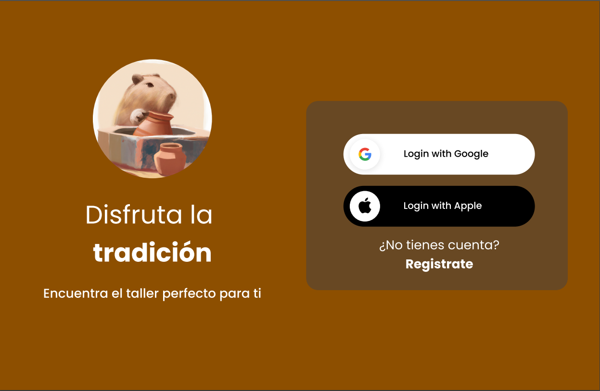

# DIU - Practica 3, entregables

## Moodboard (diseño visual + logotipo)   
-----
En este apartado mostramos como estamos mostrando nuestra propia perspectiva orientada al arte nazarí, primero el logotipo hemos querido mantener la esencia del arte nazarí pero a su vez dandole nuestro propio toque distintivo a la hora de que hablen de nosotros tengamos algo caracteristico donde poder recordarnos, en nuestro caso hemos agregado un capibara con jarrones en las manos al estilo de esta artesanía. 
En el caso de los colores nos hemos basado en colores tierra, marron , beige y de  este estilo en base a imagenes de este arte mas repreenttivas o de la propia alhambra que es lo primero que se te puede venir a la mente cuando hablamos de Nazaries, Mas concretamente hemos elegido el color 8D4F00 
La elección de la tipografía Roboto para una web de arte Nazarí se basa en su legibilidad, versatilidad, disponibilidad, compatibilidad y capacidad para crear contraste visual. Estas cualidades pueden ayudar a transmitir la estética y la esencia de la forma de arte Nazarí, al tiempo que brindan una experiencia de usuario agradable y accesible. 

## Landing Page

Hemos realizado la siguiente landing page para acceder a la app o para registrarse:

## Mockup: LAYOUT HI-FI
Hemos realizado un prototipo a traves de la herramienta de figma donde podríamos ver algunas funcionalidaes básicas de nuestra aplicación una vez este completa.

https://github.com/seryiiqteca/DIU_CafeDerramao/assets/67373495/ac0e80a5-1b40-4719-b691-b8c54c2db24a

## Documentación: Publicación del Case Study

(incluye) Valoración del equipo sobre la realización de esta práctica o los problemas surgidos
 
