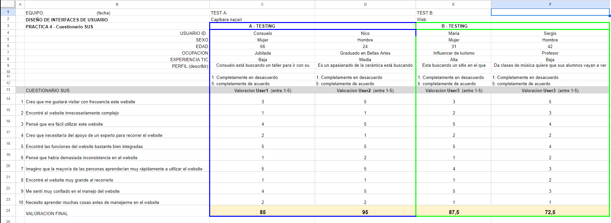

# DIU - Practica 4, entregables

* Users 

USUARIO 1:CONSUELO, mujer de 66 años jubilada, ha estado aburrida estos dias y quiere hacer algo interesante con su marido y poder relajarse juntos, tiene un movil que le regalaron sus nietos el cual usa para hablar por whatsapp y poco mas.

USUARIO 2:NICO, hombre de 24 años desempleado pero recien graduado en Bellas Artes , en la carrera descubrió que le encantaba la cerámica y esta de visita unos dias por Granada con unos amigos y cree que puede ser una buena idea una actividad de este tipo

USUARIO 3:MARIA, mujer de 31 años influencer sobre turismo, está haciendo videos por Granada y quiere buscar algun sitio donde cenar y podcer grabar algo de contenido.

USUARIO 1:SERGIO, hombre de 42 años profesor , da clases de musica y quiere que sus alumnos vayan a ver algo de música de su tierrra(flamenco)

* A/B Testing. 

[Archivo con A/B testing](https://github.com/seryiiqteca/DIU_CafeDerramao/files/11655658/CafeDerramao-Sardinillas-Cuestionario_DIU4.xlsx)

>>> - Valoración final (numérica): 80 (excellent)

* Usability Report de Caso B
* Template de usability.gob (https://www.usability.gov/how-to-and-tools/resources/templates/report-template-usability-test.html) 

* Conclusiones
  La página luce bien diseñada y si la navegación es como suponemos (a falta del archivo .fig) las tareas serían relativamente sencillas de realizar, el problema puede yacer en ciertos problemas en la interfaz como ciertos apartados de contraste (las estrellas de los comentarios por ejemplo) y el muy excesivo uso de tarjetas donde debería haber objetos como listas.
