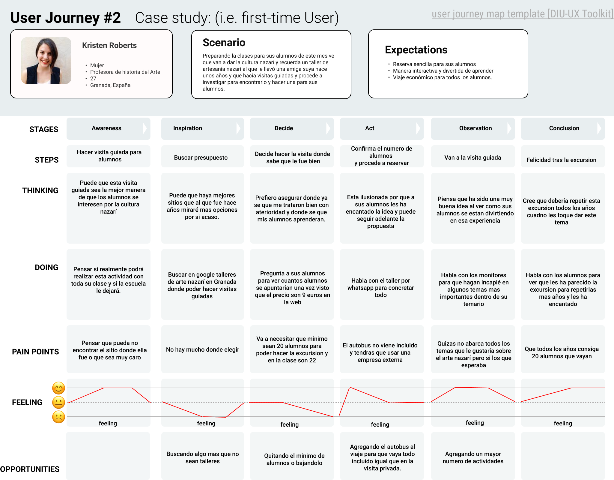

# DIU23
Prácticas Diseño Interfaces de Usuario 2022-23 (Tema: .... ) 

Grupo: DIU1_01AABB.  Curso: 2022/23 
Updated: 11/1/2023

Proyecto: 
>>> Decida el nombre corto de su propuesta en la práctica 2 

Descripción: 

>>> Describa la idea de su producto en la práctica 2 

Logotipo: 
>>> Opcionalmente si diseña un logotipo para su producto en la práctica 3 pongalo aqui

Miembros
 * :bust_in_silhouette:   SERGIO VILAR PEREZ     :octocat:     
 * :bust_in_silhouette:  JAVIER LINDE MARTINEZ     :octocat:

----- 

# Proceso de Diseño 

## Paso 1. UX Desk Research & Analisis 

 1.a Empathy Map

La página es muy caótica el sentimiento del usuario estará muy compuesto por situaciones de desorientación. El tema de la seguridad da mucha desconfianza.  

 1.b Competitive Analysis
-----

La competencia más directa que hemos encontrado se trata de Kerarqueo, empresa la cual tiene de 2 a 10 empleados y que se encuentra en la calle Recogidas, respecto a nuestra elección "Artesanía Nazarí" las fortalezas que tiene Kerarqueo son: la localización en Granada capital, su página web no hable nuevas pestañas constantemente y está mejor posicionada en Google. Luego Kerarqueo es débil en cuanto a que Artesanía Nazarí incluye el viaje en el precio, permite la reserva de manera online y oferta visitas escolares. Las amenazas que enfrenta Artesanía Nazarí son: la ausencia del certificado SSL en la página de compra y la dificultad de encontrar información respecto a los talleres, las oportunidades que tiene son: la mejora de la página web (encontrar la información más rápido) y mejorar el seo de la web.

 1.c Persona
-----

Hemos escogido dos perfiles Sergio y Anne, son 2 tipos de personas diferentes que buscan 2 tipos de ruta diferente pero que concluyen el mismo sitio, Anne por ejemplo al organizar una visita escolar necesita más garantías y certezas y Sergio necesita encontrar un buen precio y realizar todo de manera rápida sin tener que darle muchas vueltas a nada.

Anne:

Sergio:

 1.d User Journey Map
----

Ambos debían organizar el viaje, son situaciones relativamente comúnes ya que se tratan de una visita turística que puede tener cierto grupo de usuarios que esten interesados en ese sector, Sergio quiere darle una sorpresa a su amigo que le gusta este mundo y Anne se dedica a dar clases de una asignatura que está directamente relacionada con el arte y la artesanía.

Anne:

Sergio:

 1.e Usability Review
----
- Enlace al documento: [UsabilityReview PDF](P1/Documentation/UsabilityReview.pdf)
- Valoración final (numérica): 45
- Comentario sobre la valoración:  La página web deja mucho que desear muchas de sus funcionalidades no son muy útiles (como la búsqueda) y además la sección de compra y que esta no tenga certificado de seguridad son errores muy graves.

## Paso 2. UX Design  

 2.a Feedback Capture Grid / EMpathy map / POV
----

>>> Comenta con un diagrama los aspectos más destacados a modo de conclusion de la práctica anterior,

 Interesante | Críticas     
| ------------- | -------
  Preguntas | Nuevas ideas
  
    
>>> ¿Que planteas como "propuesta de valor" para un nuevo diseño de aplicación para economia colaborativa ?
>>> Problema e hipótesis
>>>  Que planteas como "propuesta de valor" para un nuevo diseño de aplicación para economia colaborativa te
>>> (150-200 caracteres)

 2.b ScopeCanvas
----
>>> Propuesta de valor 

 2.b Tasks analysis 
-----

>>> Definir "User Map" y "Task Flow" ... 

 2.c IA: Sitemap + Labelling 
----

>>> Identificar términos para diálogo con usuario  

Término | Significado     
| ------------- | -------
  Login¿?  | acceder a plataforma

 2.d Wireframes
-----

>>> Plantear el  diseño del layout para Web/movil (organización y simulación ) 

## Paso 3. Mi UX-Case Study (diseño)

 3.a Moodboard
-----

>>> Plantear Diseño visual con una guía de estilos visual (moodboard) 
>>> Incluir Logotipo
>>> Si diseña un logotipo, explique la herramienta utilizada y la resolución empleada. ¿Puede usar esta imagen como cabecera de Twitter, por ejemplo, o necesita otra?

  3.b Landing Page
----

>>> Plantear Landing Page 

 3.c Guidelines
----

>>> Estudio de Guidelines y Patrones IU a usar 
>>> Tras documentarse, muestre las deciones tomadas sobre Patrones IU a usar para la fase siguiente de prototipado. 

  3.d Mockup
----

>>> Layout: Mockup / prototipo HTML  (que permita simular tareas con estilo de IU seleccionado)

 3.e ¿My UX-Case Study?
-----

>>> Publicar my Case Study en Github..
>>> Documente y resuma el diseño de su producto en forma de video de 90 segundos aprox

## Paso 4. Evaluación 

 4.a Caso asignado
----

>>> Breve descripción del caso asignado con enlace a  su repositorio Github

 4.b User Testing
----

>>> Seleccione 4 personas ficticias. Exprese las ideas de posibles situaciones conflictivas de esa persona en las propuestas evaluadas. Asigne dos a Caso A y 2 al caso B
 

| Usuarios | Sexo/Edad     | Ocupación   |  Exp.TIC    | Personalidad | Plataforma | TestA/B
| ------------- | -------- | ----------- | ----------- | -----------  | ---------- | ----
| User1's name  | H / 18   | Estudiante  | Media       | Introvertido | Web.       | A 
| User2's name  | H / 18   | Estudiante  | Media       | Timido       | Web        | A 
| User3's name  | M / 35   | Abogado     | Baja        | Emocional    | móvil      | B 
| User4's name  | H / 18   | Estudiante  | Media       | Racional     | Web        | B 

. 4.c Cuestionario SUS
----

>>> Usaremos el **Cuestionario SUS** para valorar la satisfacción de cada usuario con el diseño (A/B) realizado. Para ello usamos la [hoja de cálculo](https://github.com/mgea/DIU19/blob/master/Cuestionario%20SUS%20DIU.xlsx) para calcular resultados sigiendo las pautas para usar la escala SUS e interpretar los resultados
http://usabilitygeek.com/how-to-use-the-system-usability-scale-sus-to-evaluate-the-usability-of-your-website/)
Para más información, consultar aquí sobre la [metodología SUS](https://cui.unige.ch/isi/icle-wiki/_media/ipm:test-suschapt.pdf)

>>> Adjuntar captura de imagen con los resultados + Valoración personal 

 4.d Usability Report
----

>> Añadir report de usabilidad para práctica B (la de los compañeros)

>>> Valoración personal 

>>> ## Paso 5. Evaluación de Accesibilidad  (no necesaria)

>>>   5.a Accesibility evaluation Report 
>>>> ----

>>> Indica qué pretendes evaluar (de accesibilidad) sobre qué APP y qué resultados has obtenido 

>>> 5.a) Evaluación de la Accesibilidad (con simuladores o verificación de WACG) 
>>> 5.b) Uso de simuladores de accesibilidad 

>>> (uso de tabla de datos, indicar herramientas usadas) 

>>> 5.c Breve resumen del estudio de accesibilidad (de práctica 1) y puntos fuertes y de mejora de los criterios de accesibilidad de tu diseño propuesto en Práctica 4.

## Conclusión final / Valoración de las prácticas

>>> (90-150 palabras) Opinión del proceso de desarrollo de diseño siguiendo metodología UX y valoración (positiva /negativa) de los resultados obtenidos  

